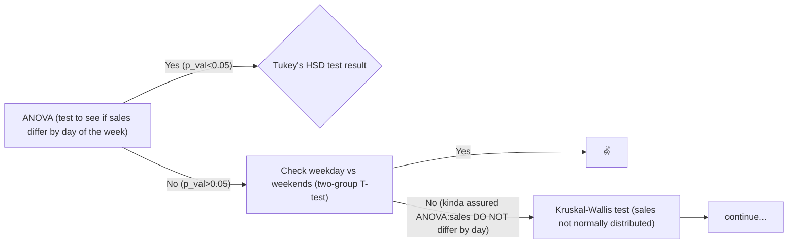

# 20250914 Supermarket Sales Analysis
> 咱就是说，差点儿开始即结束 🥶  
> 

---

## data description & preparation 
  💻 1000 line, 3-month supermarket sales data downloaded from Kaggle [lovishbansal123](https://www.kaggle.com/datasets/lovishbansal123/sales-of-a-supermarket)  
  
  the data set is already clean&uniformed, so i did not do much modification except combined sales' date&time into one field 'transtime'

## calculation & analysis
  🏁 the goal is to find out which **factor(s) contributes more into sales and margins**, or how are sales&margins affected  
  
  ➕ sum of 'Sales' by day, week, and month is the dependent variable

### blind start 🤣
  i started with the simplest assumption that Dates(weekday/weekends) might influnce customer purchase.  
  📊 by draging variables around in Tableau has shown messy line graph (sales-day/week-product line), which already given signs of WRONG-thought-pathway.  
  i insisted 🤣 ，just to try out the process  
  🤡 i thought i could go like :  
  

