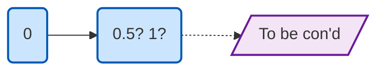

# 2025-09-05 星期五 21:37 ✨ first try

> ▶️ 安排一个开始  
> ❌ try not to 0/10, 分拆✅0-1-2-3...9-10

---

## 📝 possible to do list

- [ ] 搜集主题
- [ ] 查找 available dataset（kaggle）
- [ ] 参考 topic 列出可分析的方向
- [x] create git repo
- [x] 放个抽象文档
- [ ] data cleaning
- [ ] modeling 
- [ ] output
  - [ ] 图
  - [ ] 文
  - [ ] BI

---

## 🉑 well,好像也还行，接受程度 up 了一丢丢

---

*_22:59  先这样吧就，缝缝补补之后再...*
